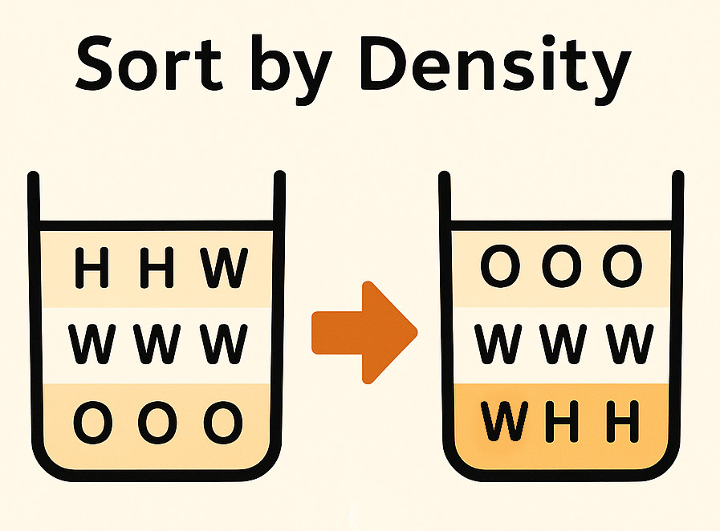

# 🧪 Задача: **Разделение жидкости на слои** ( Liquids separation )

Дано двумерное представление стакана с перемешанными жидкостями в виде массива символов.

Нужно **отсортировать массив так, чтобы жидкости расположились по плотности** — менее плотные окажутся сверху, более плотные — снизу.

Ширина стакана при этом не меняется (она одинакова у всех слоёв).



---

### 📊 **Таблица плотности жидкостей:**

| Название | Символ | Плотность |
| :--------------: | :----------: | :----------------: |
|      Мёд      |    `H`    |        1.36        |
|     Вода     |    `W`    |        1.00        |
| Алкоголь |    `A`    |        0.87        |
|    Масло    |    `O`    |        0.80        |

---

## 📦 **Пример входных и выходных данных:**

Вход:

```text
{
  { 'H', 'H', 'W', 'O' },
  { 'W', 'W', 'O', 'W' },
  { 'H', 'H', 'O', 'O' }
}
```

Результат после сортировки по плотности:

```text
{
  { 'O', 'O', 'O', 'O' },
  { 'W', 'W', 'W', 'W' },
  { 'H', 'H', 'H', 'H' }
}
```

---

### ⚙ **Примечания:**

* Стакан может быть  **любой высоты и ширины** .
* Если жидкости не заполняют полностью слой, более лёгкие поднимаются наверх и сдвигаются влево.

---
